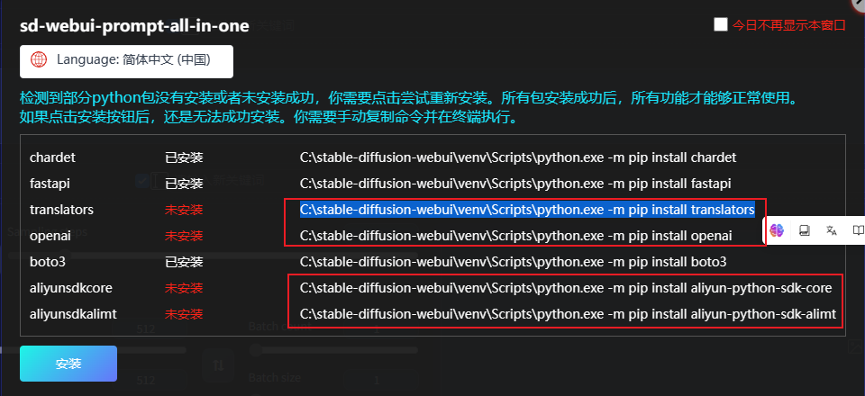

# Installation Packages

> In some cases, the required python software packages for this extension may not be installed automatically after completing the installation and restarting the WebUI. In such cases, the extension will prompt you to install the packages manually.

## Automatic Installation

1. Click `Language` to switch the language.

2. Click `Install` to start the installation process.

3. Wait for the installation to complete. The installation window will close automatically after completion.

4. Refresh the WebUI page to use this extension.

## Manual Installation

> If automatic installation fails or the installation window still pops up after refreshing the webpage, you can try to install the packages manually.

1. Copy the commands behind the uninstalled package manually.

    

2. Open the system terminal, paste the commands, and execute them.

    

3. After all the commands are executed, refresh the WebUI page to use this extension normally.