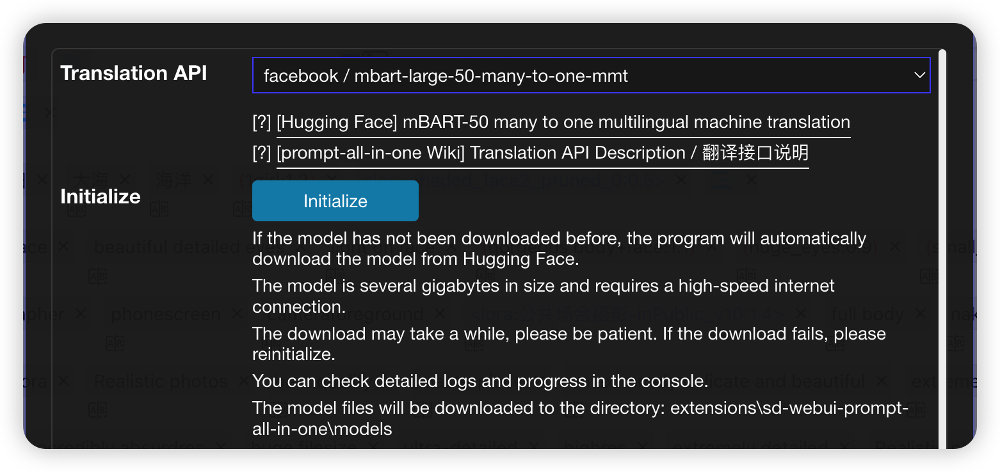

# Offline Translation

## facebook/mbart-large-50-many-to-one-mmt

### Automatic Download

1. After clicking the `Initialize` button, if the model has not been downloaded before, it will be automatically downloaded from `HuggingFace`.
2. The downloaded model will be saved in the `\extensions\sd-webui-prompt-all-in-one\models\` directory.
3. Automatic download requires a high-speed network environment. If the download fails, you can try [manual download](#manual-download).
4. The download time can be quite long, so please be patient.
5. If the download fails, you can try clicking the `Initialize` button again.

### Manual Download

> :warning: The extension version requires [6976a4c](https://github.com/Physton/sd-webui-prompt-all-in-one/commit/6976a4ce0d857c900207544d8d3a6e8084b8406b) or above.

#### Download Links

- [Google Drive](https://drive.google.com/file/d/1uH76hI-2WcC-jH4yYcg2-Bni90-XwAkd/view?usp=sharing)
- [123云盘（不限速）](https://www.123pan.com/s/HcqbVv-Lp0I.html)
- [百度网盘](https://pan.baidu.com/s/1PdEoMV2JvC5PBJt29QxlEQ?pwd=a7wt)

1. After downloading, extract the `mbart-large-50-many-to-many-mmt.zip` file to the `\extensions\sd-webui-prompt-all-in-one\models\mbart-large-50-many-to-many-mmt` directory.

    

2. The directory structure should be as follows:

   

3. Click the `Initialize` button.

4. Wait for the initialization to complete.