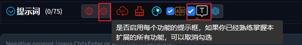

# Tooltip

1. Move the mouse over the `Tooltip checkbox` and select whether to check it according to your needs.

    

2. After installing the extension for the first time, the `Tooltip checkbox` is checked by default.

3. If you are familiar with the function of each button in this extension, you can uncheck it, so that the tooltip will not pop up when you move the mouse over the button.