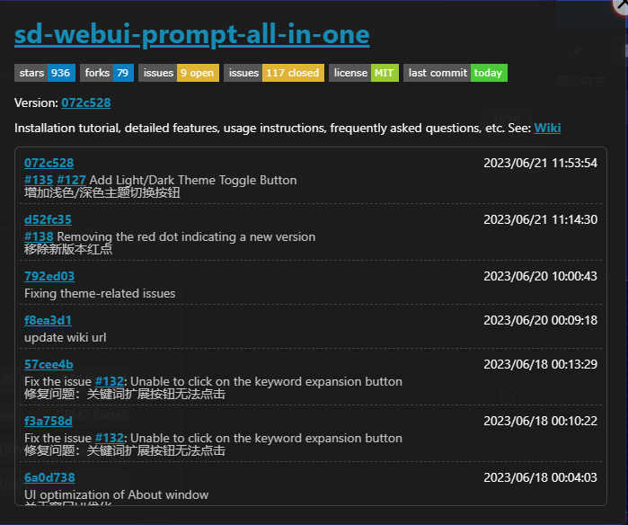

# О странице

1. Наведите курсор на значок `О странице`.

   

2. Нажмите на значок `О странице`.

   

3. Нажмите на `sd-webui-prompt-all-in-one`, чтобы открыть репозиторий этого проекта на GitHub.

4. Если доступна новая версия, на этой странице будет отображено сообщение `Обнаружена новая версия`.

5. Если вам нужно обновить эту версию расширения, ознакомьтесь с [Инструкцией по обновлению расширения](/ru/ExtensionUpdateDescription.md).