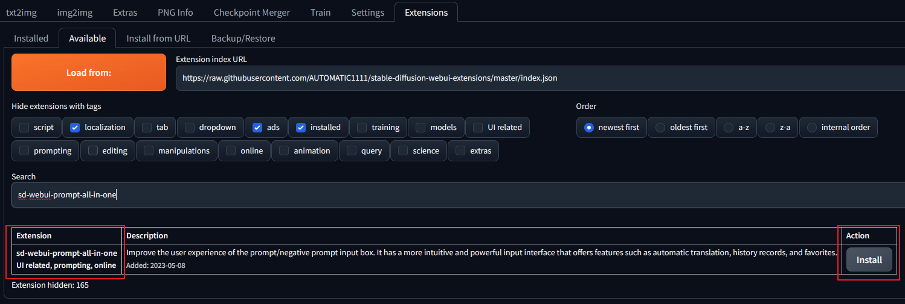
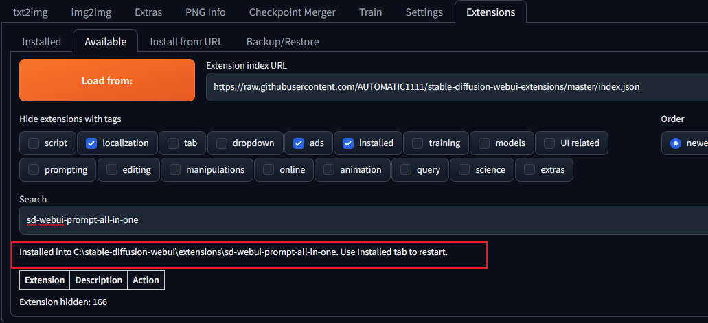

# Установка

## Требования к установке

- Версия Stable Diffusion WebUI: [3715ece (7-я неделя 2023 года)](https://github.com/AUTOMATIC1111/stable-diffusion-webui/commit/3715ece) или выше.
- Версия Python: примерно `3.10.11` (установка версий `3.9` или `3.11` может привести к проблемам с установкой пакетов Python).
- Операционная система: `Windows`, `Linux`, `MacOS` и т. д.
- Браузер: не включайте расширения перевода, такие как Deepl.

## Метод установки

### Метод 1 (используя git clone):

> Для этого метода требуется установленный на вашем компьютере Git. Если его нет, вы можете ознакомиться с [официальной документацией Git](https://git-scm.com/book/ru/v2/Введение-Установка-Git) и выполнить установку.

1. Откройте терминал и перейдите в каталог `stable-diffusion-webui`.

   

2. Склонируйте `sd-webui-prompt-all-in-one` из git в каталог `stable-diffusion-webui\extensions`.

    ```shell
    git clone "https://github.com/Physton/sd-webui-prompt-all-in-one.git" extensions/sd-webui-prompt-all-in-one
    ```

   

3. Перезапустите Stable Diffusion WebUI.

### Метод 2 (установка из URL-адреса):

1. Откройте веб-интерфейс WebUI.

2. Нажмите `Extensions` - `Установить из URL-адреса`.

   

3. Введите `https://github.com/Physton/sd-webui-prompt-all-in-one.git`.

4. Нажмите `Установить` и дождитесь окончания установки. Этот процесс может занять несколько минут или дольше. После установки появится сообщение об успешном завершении.

   

5. Нажмите `Установлено` - `Сохранить и перезапустить интерфейс`.

   

### Метод 3 (установка из официального репозитория расширений):

1. Откройте веб-интерфейс WebUI.

2. Нажмите `Extensions` - `Доступные`  - `Загрузить из`.

   

3. Найдите `sd-webui-prompt-all-in-one` и нажмите `Установить`.

   

4. Дождитесь окончания установки. Этот процесс может занять несколько минут или дольше. После установки появится сообщение об успешном завершении.

   

5. Нажмите `Установлено` - `Сохранить и перезапустить интерфейс`.

   

### Метод 4 (установка из исходного кода):

> Этот метод установки не поддерживает автоматическое обновление и не рекомендуется!

1. Скачайте архив с исходным кодом `sd-webui-prompt-all-in-one`.

   

2. Распакуйте архив в каталог `stable-diffusion-webui\extensions`.

   

3. Перезапустите Stable Diffusion WebUI.

## Примечания

1. После установки любым из методов необходимо перезапустить Stable Diffusion WebUI.

2. Если в процессе установки возникнут ошибки, вам нужно вручную удалить каталог `stable-diffusion-webui\extensions\sd-webui-prompt-all-in-one`, затем перезапустить Stable Diffusion WebUI и повторить установку.

3. Установка может занять несколько минут или дольше. Пожалуйста, будьте терпеливы.

4. Убедитесь, что ваша версия WebUI не ниже [3715ece (7-я неделя 2023 года)](https://github.com/AUTOMATIC1111/stable-diffusion-webui/commit/3715ece). Если ваша версия WebUI ниже этой версии, вам нужно обновить WebUI.


5. Если вы запустили WebUI с параметром `--data-dir`, вам нужно добавить параметр `--gradio-allowed-path="Расширенный путь к папке"`.
   
   Если вы не добавите параметр `--gradio-allowed-path`, большинство сторонних расширений не смогут работать, а не только это расширение.

   `--gradio-allowed-path="Расширенный путь к папке"`

   или

   `--gradio-allowed-path="путь к папке Data\extensions\"`