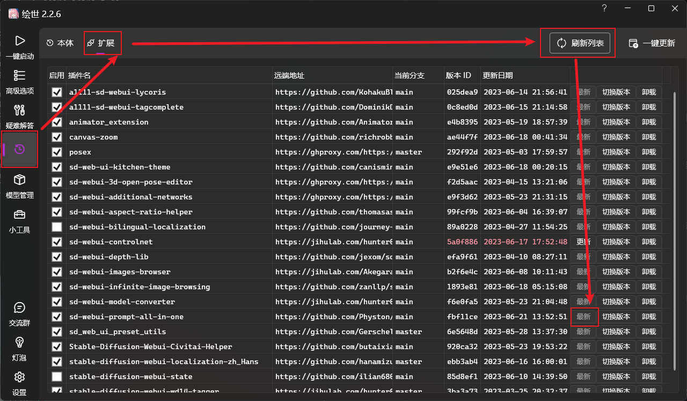

# 扩展更新说明

1. 你的所有数据：API KEY、历史记录、收藏数据等，都保存在扩展的 `storage` 目录下。

2. 使用WebUI自带的更新器，或者使用git更新，都不会导致你的数据丢失。

3. 使用压缩包等方式覆盖安装，或者删除扩展后重新安装，都会导致你的数据丢失。

4. 如果你想备份你的数据，可以将 `storage` 目录复制到其他地方，然后在需要的时候将其复制回来。

## 更新方式

### 方式一（使用git更新）：

> 此方法需要你的电脑上安装了 git，如果没有安装，可参考 [git 官方文档](https://git-scm.com/book/zh/v2/起步-安装-Git) 进行安装。

1. 打开终端，进入到你的扩展目录下。
    
    ```shell
    cd 你的WebUI文件夹路径\extensions\sd-webui-prompt-all-in-one
    ```

2. 使用 git 更新。

    ```shell
    git pull
    ```

   

3. 重新启动 Stable Diffusion WebUI。

### 方式二（在WebUI中更新）：

1. 打开 WebUI 网页。

2. 点击 `扩展` - `已安装` - `检查更新`。

3. 点击 `保存并重启UI`。

   

### 方式三（在秋葉启动器中更新）：

> 如果你使用了秋葉启动器，你可以在秋葉启动器中更新扩展。

1. 打开 `秋葉启动器`。

2. 点击 `版本管理` - `扩展` - `刷新列表`。

3. 点击 `sd-webui-prompt-all-in-one` 后面的 `更新` 按钮。

   

4. 重新启动 Stable Diffusion WebUI。