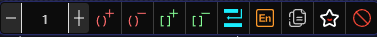
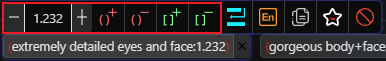
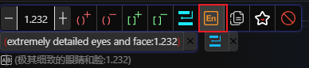
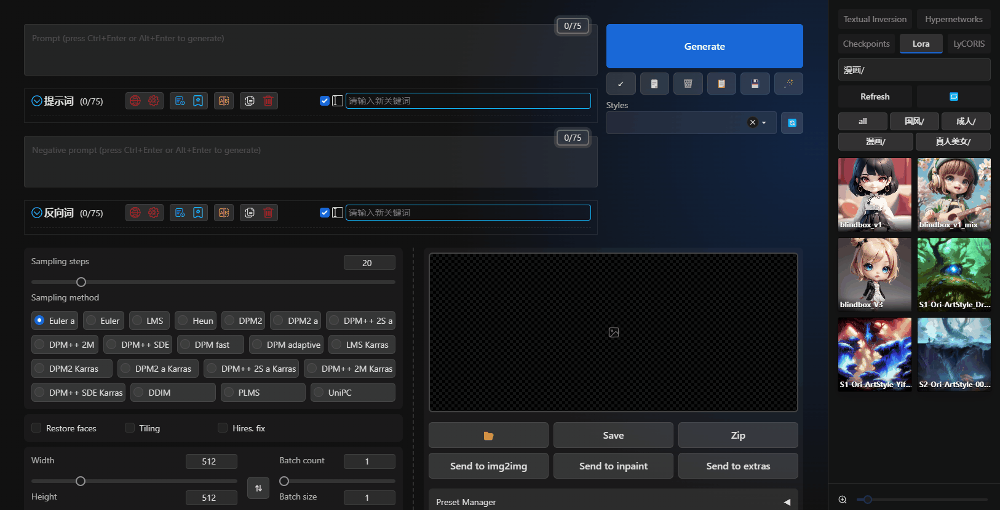

# 关键词列表

## 关键词操作

1. 鼠标移动到每个关键词上，你可以针对每个关键词进行单独的调整。
2. 如果你想要调整按钮的位置显示在关键词右侧，你可以前往 [主题风格](/zh-CN/ThemeStyle.md#主题风格) 中开启此功能。

## 拖动排序

你可以通过鼠标左键按住关键词，拖动到你想要的位置。

> 如果你拖动关键词后，WebUI的输入框中出现了重影，可能是因为你的浏览器安装了DeepL或者其它的翻译插件。

## 权重调整

1. 你可以在权重数输入框中输入数字，也可以直接点击左右的加减按钮进行调整。
2. 权重数最高支持6位小数，默认按照0.1递增和递减。
3. 你可以点击 `括号` 按钮，对关键词进行增减不同的括号包裹。

## 插入换行符

点击 `换行` 按钮，可以在当前关键词的后面插入一个换行符号。

## 翻译到英文

> 在英文语言环境下，这个按钮将被隐藏。

如果当前关键词不是英文的，你可以点击 `翻译到英文` 按钮，将当前关键词翻译成英文。

## 复制关键词

点击 `复制` 按钮，可以将当前关键词复制到剪贴板。

## 收藏/取消收藏

1. 点击 `收藏` 按钮，可以将当前关键词收藏到收藏夹中。
2. 如果当前关键词已经收藏，点击 `收藏` 按钮，可以将当前关键词从收藏夹中移除。

## 禁用关键词

1. 点击 `禁用` 按钮，可以将当前关键词禁用。
2. 如果当前关键词已经禁用，点击 `禁用` 按钮，可以将当前关键词启用。
3. 禁用的关键不会加入到WebUI的输入框中，在你需要的时候可以再启用。
4. 可以透過雙擊關鍵詞來進行禁用/啟用操作。

## 翻译到本地语言

> 在英文语言环境下，这个按钮将被隐藏。

点击 `翻译到本地语言` 按钮，可以将当前关键词翻译成本地语言显示。

## 高亮关键词

1. Lora、LyCORIS、Textual Inversion 关键词会被高亮显示。
2. Lora、LyCORIS 如果不存在于你的模型列表中，会高亮闪烁提醒你。
3. Lora、LyCORIS、Textual Inversion 关键词，翻译并不会从网络翻译。而是从 `Civitai助手` 的本地nfo文件中读取原始名称。

## 在WebUI输入框中高亮关键词

鼠标移动到关键词上，会在WebUI输入框中高亮显示该关键词。