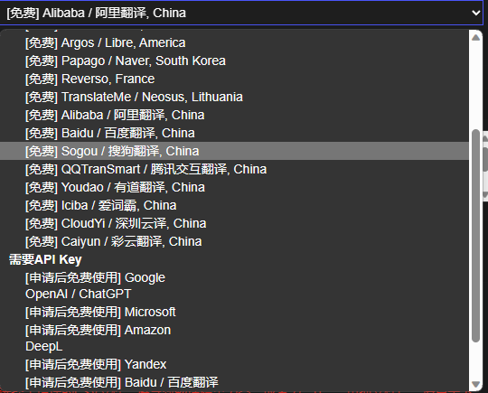

# 翻譯API配置

> 在英文語言環境下，這個按鈕將被隱藏。

## 打開翻譯API配置視窗

1. 滑鼠移動到 `設置按鈕圖標` 上。

    

2. 點擊 `翻譯API配置圖標`。

    

## 翻譯接口說明

1. 本擴展集成了眾多翻譯接口，你可以根據自己的需求，選擇合適的翻譯接口。

    

2. 目前分為 `不需要API KEY` 和 `需要API KEY` 兩類。

    

3. `需要API KEY` 的接口，選擇後，會有申請教程文檔，根據教程文檔，自己申請。

4. `不需要API KEY` 的接口，如果翻譯失敗，請嘗試切換其他接口，不要提交issue。

5. 請自己根據每個接口的翻譯速度和質量，選擇合適的接口。

## 翻譯接口對比

|  | 不需要API KEY | 需要API KEY |
| :---: | :---: | :---: |
| 收費 | 免費 | 大部分免費 可能每個月有翻譯字符數的限制，但基本上免費的額度完全足夠我們使用。 |
| 穩定 | 非常不穩定 根據每個人的電腦環境和網絡環境不同，其中部分可能無法使用。 非常不穩定，可能隨時失效。 在測試時可能翻譯成功，但是在實際使用時可能翻譯失敗。 | 非常穩定 基本不會失效。 翻譯基本不會失敗。 |
| 速度 | 非常慢 | 非常快 |

## 翻譯接口免費額度

| 翻譯接口 | 免費額度 |
| :---: | :---: |
| 不需要API KEY的接口 | 無限 |
| Google | 每月免費50萬字符 |
| OpenAI / ChatGPT | 首次開通贈送5美元體驗金 |
| Microsoft | 每月200萬字符（僅限註冊 Azure 後的前12個月） |
| Amazon | 每月200萬字符（僅限註冊 AWS 後的前12個月） |
| DeepL | 免費版每月50萬字符 |
| Yandex | 未知 |
| MyMemory | 每天5萬字符 |
| Baidu / 百度翻譯 | 每月5萬字符 |
| Alibaba / 阿里翻譯 | 每月免費100萬字符 |
| Youdao / 有道翻譯 | 新用戶註冊贈送50元體驗金 |
| Tencent / 腾讯翻译 | 每月免費500萬字符 |
| Niutrans / 小牛翻译 | 需要簽到領取 |
| Caiyun / 彩云小译 | 每月免費100萬字符 |

## 接口測試

1. 選擇一個接口，點擊 `測試` 按鈕。

2. 翻譯成功，則會顯示翻譯結果。

3. 翻譯失敗，則會顯示錯誤信息。

## TagComplate 翻譯增強

> 是否啟用 [a1111-sd-webui-tagcomplete](https://github.com/DominikDoom/a1111-sd-webui-tagcomplete) 中的 CSV 文件以增強翻譯功能。
>
> 啟動此功能後，會減少網絡請求，翻譯結果更精準。
>
> 此功能的原理是，針對每個單詞，將自動從 CSV 文件中查找翻譯結果，如果找到，則不會再請求網絡翻譯接口，如果沒有找到，則會請求網絡翻譯接口。
>
> 所以，如果你的 CSV 文件中沒有你要翻譯的單詞，那麼此功能將不會生效。

1. 此功能不需要你安裝 [a1111-sd-webui-tagcomplete](https://github.com/DominikDoom/a1111-sd-webui-tagcomplete) 擴展。你可以直接把翻譯過的 CSV 文件，放到 `extensions\sd-webui-prompt-all-in-one\tags` 目錄下。如果沒有此目錄，請自己創建。

    

2. 你需要選擇正確的 CSV 文件，否則將導致部分單詞翻譯失敗、翻譯結果為0、翻譯的語言不正確等等。

3. 你可以使用 Excel 打開 CSV 文件，查看內容格式是否正確，正確的格式如下：

    | 序號 | 英文 | 你的語言（這裡以中文示例） |
    | :---: | :---: | :---: |
    | 1 | 1girl | 1女孩 |
    | 2 | 1boy | 1男孩 |
    | ... | ... | ... |

    

4. 點擊 `刷新` 按鈕，選擇正確的 CSV 文件。

    

5. 點擊 `測試` 按鈕。檢查翻譯結果是否正確。測試結果中，每一行的前面為英文單詞，後面為你的語言翻譯結果。如果後面的翻譯結果不正確，請檢查你的 CSV 文件是否正確，否則不要啟動此功能。

    

6. 如果你只想在自動翻譯時，只使用CSV進行翻譯，不使用網絡翻譯接口，那麼請勾選以下選項。勾選後，只有你手動點擊翻譯按鈕，才會使用網絡翻譯接口。

    