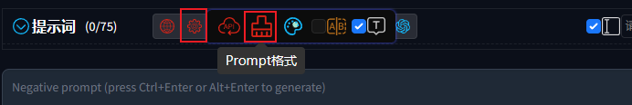

# Формат подсказок

1. Наведите курсор на иконку `кнопки настроек`.

   

2. Нажмите на `иконку настройки формата подсказки`.

   

3. Настройте формат подсказок в соответствии с вашими потребностями.

   