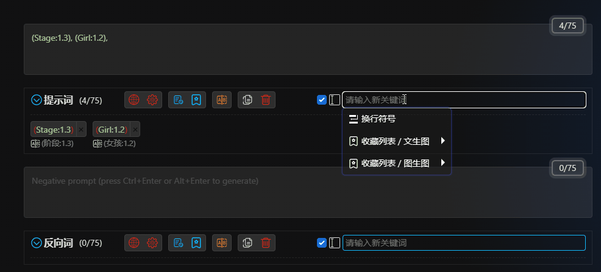

# Коробка ввода ключевых слов

1. Вы можете вводить на своем родном языке, и если вы включили автоматический перевод, ваш ввод будет автоматически переведен на английский язык. Если вы не включили автоматический перевод, вы также можете вручную нажать кнопку перевода после ввода.

2. Вы можете вводить не английские знаки препинания, такие как `，` `。` `（）` `【】` и т. д., они будут автоматически преобразованы в английские знаки препинания. Это избавляет вас от необходимости вручную переключать язык ввода.

3. Поддержка функции расширения [a1111-sd-webui-tagcomplete](https://github.com/DominikDoom/a1111-sd-webui-tagcomplete) (для ее использования требуется установить это расширение).

   

4. Если в поле ввода нет никакого содержимого, при нажатии на поле ввода будет показано выпадающее меню. Вы можете выбирать содержимое меню с помощью мыши или клавиш со стрелками и клавиши Enter. Если вы не хотите использовать выпадающее меню, вы можете отключить его в [Темах](/ru/ThemeStyle.md#Темы-оформления).

5. Вы можете выбрать `Символ перевода строки` в выпадающем меню. Это вставит символ перевода строки в поле ввода WebUI. Если вам нужно, чтобы символ перевода строки отображался на самом деле как перенос строки в панели расширения, вы можете включить эту функцию в [Темах](/ru/ThemeStyle.md#Темы-оформления).

6. Вы можете выбрать `Закладки` в выпадающем меню и вставить их после текущих закладок. (Кнопка `Использовать` в закладках очищает текущие закладки, а здесь она вставляет).