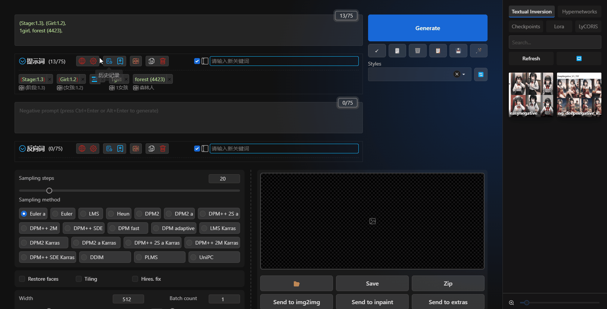

# Темы оформления

1. Наведите курсор на значок `Расширенные стили темы`.

   

2. Нажмите на значок `Расширенные стили темы`.

   

3. Существуют две категории: "Тема" и "Улучшить".

   - "Темы": в основном изменяют общий стиль темы расширения.
   - "Улучшить": в основном улучшают стиль расширения.

4. В категории "Темы" рекомендуется активировать только одну тему, чтобы избежать конфликта стилей.

5. В зависимости от своих потребностей выберите разные темы оформления.

   

6. Если вам нужно разработать тему оформления для этого расширения, см. [https://github.com/Physton/sd-webui-prompt-all-in-one/tree/main/styles/extensions#english](https://github.com/Physton/sd-webui-prompt-all-in-one/tree/main/styles/extensions#english)