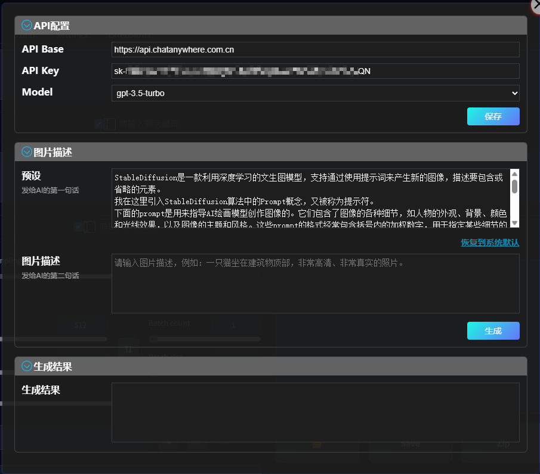

# Использование ChatGPT для генерации подсказок

## Открытие окна

1. Наведите указатель мыши на кнопку `Использовать ChatGPT для генерации подсказок`.

   

2. Откройте окно.

   

## Настройка ChatGPT

### API Base

1. Официальный адрес API - `https://api.openai.com/v1`
2. Если у вас нет доступа к официальному сайту, вы можете найти или настроить прокси-сервер. Укажите адрес прокси-сервера в поле `API Base`. Обратите внимание, что любой прокси-сервер от третьих лиц может привести к утечке вашего API-ключа или нарушению вашей конфиденциальности. Используйте его осторожно.

### API KEY

1. Получите свой API KEY на [OpenAI](https://platform.openai.com/docs/introduction).
2. Вы можете найти видеоуроки о получении API KEY на видеохостингах, таких как YouTube.
3. Некоторые потенциально полезные прокси-серверы:
   - `https://api.openai-proxy.com/v1`
   - `https://chatai.1rmb.tk/v1`
   - Добро пожаловать добавить еще...

### Model

1. Выберите нужную вам модель.
2. Каждая модель имеет свой способ оплаты.
3. Обычный аккаунт не может использовать модель `gpt-4`.

После заполнения нажмите кнопку "Сохранить", при следующем открытии окна вам не нужно будет заполнять поля заново.

### Бесплатный API KEY

> [chatanywhere/GPT_API_free](https://github.com/chatanywhere/GPT_API_free) Этот репозиторий GitHub предоставляет бесплатный API-интерфейс.

1. Этот проект предоставляет API KEY с максимальным ограничением в 120 запросов в час.
2. Этот проект может в любой момент перестать работать.
3. API KEY, предоставленный этим проектом, не может использоваться с официальным API Base. Укажите URL-адрес, предоставленный этим проектом, в поле API Base.
   - `https://api.chatanywhere.com.cn`
   - `https://api.chatanywhere.cn`
4. Этот проект не имеет отношения к данному расширению, и любые проблемы или убытки, связанные с его использованием, не несут ответственности авторы. Используйте его на свой страх и риск!

### Бесплатные аккаунты

- `https://free.openai.bond/`
- `https://djsfenxiang.com/`
- `https://fxmus.fxopenai.xyz/`
- Добро пожаловать добавить еще...

1. Перейдите на эти веб-сайты и используйте предоставленные ими учетные данные для входа на официальный сайт [OpenAI](https://platform.openai.com/docs/introduction).
2. После входа создайте новый ключ и используйте его.
3. Эти аккаунты могут быть недействительны в любой момент.
4. Эти веб-сайты являются сторонними веб-сайтами и не имеют отношения к данному расширению. Автор не несет ответственности за любые проблемы или убытки, возникшие при использовании этих веб-сайтов. Пожалуйста, будьте осмотрительны!

## Генерация подсказок

1. Вы можете использовать любой язык для ввода информации о картинке, например:

   > 一个女孩，她洁若冰霜，莫可逼视，秀美大气，倾国倾城，清韵典雅，淡雅宜人，风致天然，温润如玉，清澈如水，清雅不可方物，眉间如聚霜雪，冰雪出尘之姿，宛如仙女，出落得不食人间烟火，十足是个绝色的美人胚子。

2. Нажмите кнопку `Сгенерировать`.

3. Нажмите кнопку `Использовать`.

   