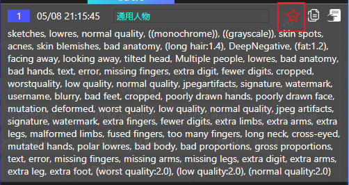

# Favorite

## Open the Favorites window

1. Move the mouse cursor over the `Favorites icon`.

    

2. Open the `Favorites icon`.

    

3. All the Prompt modifications you manually added to Favorites will be saved permanently unless you manually remove them.

    

## Functionality

1. `Set name`: Enter a name for the current Favorites record and press Enter to save.

    

2. `Remove`: Click to delete the selected Favorites record (cannot be undone).

    

3. `Copy`: Click to copy the Prompts in the selected Favorites record to your clipboard.

    

4. `Use`: Click to clear the current input and fill in the Prompts from the selected Favorites record.

    