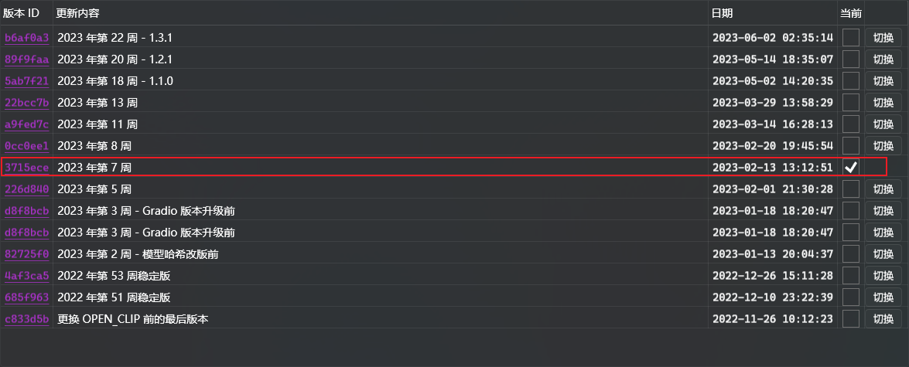

# Installation

## Installation Requirements

- Stable Diffusion WebUI version: [3715ece (Week 7, 2023)](https://github.com/AUTOMATIC1111/stable-diffusion-webui/commit/3715ece) or higher
- Python version: `≈ 3.10.11` (Using `3.9` or `3.11` may cause issues with installing Python packages)
- Operating System: `Windows`, `Linux`, `MacOS`, etc.
- Browser: Do not enable translation plugins like Deepl.

## Installation Methods

### Method 1 (Using Git Clone):

> This method requires Git to be installed on your computer. If it is not installed, please refer to the official [Git documentation](https://git-scm.com/book/en/v2/Getting-Started-Installing-Git) for installation instructions.

1. Open the terminal and navigate to your `stable-diffusion-webui` directory.

    

2. Use Git to clone `sd-webui-prompt-all-in-one` to the `extensions` directory of `stable-diffusion-webui`.

    ```shell
    git clone "https://github.com/Physton/sd-webui-prompt-all-in-one.git" extensions/sd-webui-prompt-all-in-one
    ```

    

3. Restart the Stable Diffusion WebUI.

### Method 2 (Install from URL):

1. Open the Stable Diffusion WebUI webpage.

2. Click on `Extensions` - `Install from URL`.

    

3. Enter `https://github.com/Physton/sd-webui-prompt-all-in-one.git`.

4. Click on `Install` and wait for the installation to complete. This process may take several minutes or longer. There will be a success prompt after the installation is complete.

    

5. Click on `Installed` - `Apply and Restart UI`.

    

### Method 3 (Install from Official Extension Library):

1. Open the Stable Diffusion WebUI webpage.

2. Click on `Extensions` - `Available` - `Load from`.

    

3. Find `sd-webui-prompt-all-in-one` and click on `Install`.

    

4. Wait for the installation to complete. This process may take several minutes or longer. There will be a success prompt after the installation is complete.

    

5. Click on `Installed` - `Apply and Restart UI`.

    

### Method 4 (Install from Source Code):

> This installation method cannot be updated with one click, and is not recommended!!!

1. Download the source code package for `sd-webui-prompt-all-in-one`.

    

2. Unzip it to the `stable-diffusion-webui\extensions` directory.

    

3. Restart the Stable Diffusion WebUI.


## Notes

1. After installation using any method, you need to restart Stable Diffusion WebUI.

2. If an error occurs during the installation process using any method, you need to manually delete the `stable-diffusion-webui\extensions\sd-webui-prompt-all-in-one` directory, then restart Stable Diffusion WebUI, and reinstall.

3. The installation process may take several minutes or longer, so please be patient.

4. You need to make sure that your WebUI version is [3715ece](https://github.com/AUTOMATIC1111/stable-diffusion-webui/commit/3715ece) or higher. If your WebUI version is lower than this, you need to update WebUI.
    

5. After starting with the `--data-dir` parameter, the WebUI needs to add the parameter `--gradio-allowed-path="Expanded folder path"`.

   If the `--gradio-allowed-path` parameter is not added, most third-party extensions cannot be used, not just this one.

   `--gradio-allowed-path="Expanded folder path"`

   or

   `--gradio-allowed-path="path to your Data folder\extensions\"`