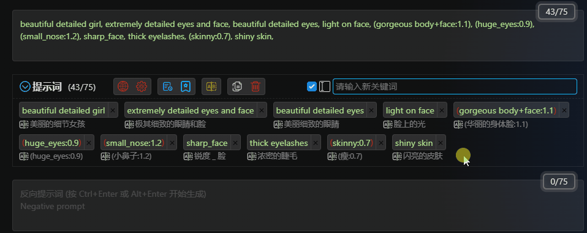

# Массовые операции с ключевыми словами

Удерживая кнопку мыши в пустом месте и перетаскивая ее, выделите ключевые слова, которые необходимо обработать массово. Появится панель массовых операций.

Перетаскивание выбранных ключевых слов позволяет перемещать несколько ключевых слов вместе в указанное место.

1. Кнопка "Копировать": копирует выбранные ключевые слова в буфер обмена.

2. Кнопка "Добавить в избранное": добавляет выбранные ключевые слова в избранное.

3. Кнопка "Отключить": отключает выбранные ключевые слова.

4. Кнопка "Включить": включает выбранные ключевые слова.

5. Кнопка "Удалить": удаляет выбранные ключевые слова.