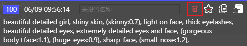
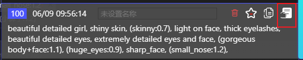

# 历史记录

## 打开记录记录窗口

1. 鼠标移动到 `历史记录图标` 上。

   

2. 打开 `历史记录图标`。

   

3. 你每次针对Prompt做的修改，都会被记录在历史记录中，你可以随时查看和使用。

   

4. 历史记录目前最多只保留100条记录，超过100条后，最早的记录会被自动删除。

## 功能说明

1. `删除所有历史记录`，点击后，会删除当前分类下的所有历史记录（不可恢复）。

   

2. `删除单个历史记录`，点击后，会删除你选中的历史记录（不可恢复）。

   

3. `收藏`，点击后，会将你选中的历史记录收藏到收藏夹中，永久保留。

   

4. `复制`，点击后，会将你选中的历史记录中的Prompts复制到你的粘贴板。

   

5. `使用`，点击后，会清空你已经输入的Prompts，并将你选中的历史记录中的Prompts填充到输入框中。

   