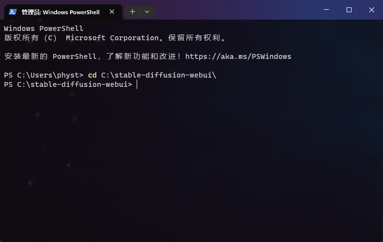
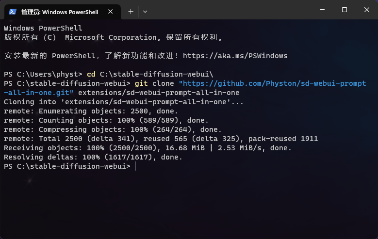
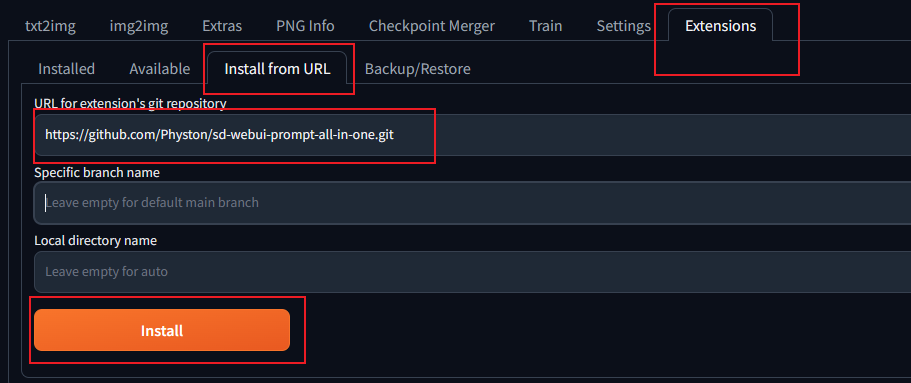
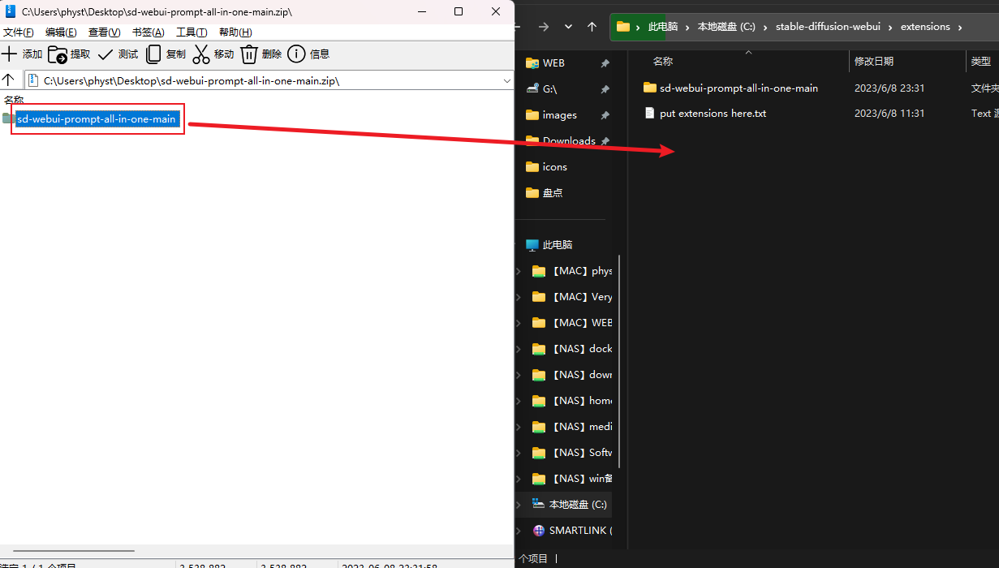

# 安装

## 安装需求

- Stable Diffusion WebUI 版本：[3715ece（2023年第7周）](https://github.com/AUTOMATIC1111/stable-diffusion-webui/commit/3715ece) 及更高
- Python 版本：`≈ 3.10.11` （`3.9`或者`3.11`可能会导致python包无法安装）
- 操作系统：`Windows`、`Linux`、`MacOS` 等等
- 浏览器：不要启用Deepl等翻译插件

## 安装方式

### 方式一（使用git克隆）：

> 此方法需要你的电脑上安装了 git，如果没有安装，可参考 [git 官方文档](https://git-scm.com/book/zh/v2/起步-安装-Git) 进行安装。

1. 打开终端，进入到你的 `stable-diffusion-webui` 目录下。

   

2. 使用 git 克隆 `sd-webui-prompt-all-in-one` 到 `stable-diffusion-webui\extensions` 目录下。

    ```shell
    git clone "https://github.com/Physton/sd-webui-prompt-all-in-one.git" extensions/sd-webui-prompt-all-in-one
    ```

   > 如果你的终端没有访问Github的网络环境，可使用以下中国镜像网站的地址：
   > ```shell
    > git clone "https://gitee.com/physton/sd-webui-prompt-all-in-one.git" extensions/sd-webui-prompt-all-in-one
    > ```

   

3. 重新启动 Stable Diffusion WebUI。

### 方式二（从网址安装）：

1. 打开 WebUI 网页。

2. 点击 `扩展` - `从网址安装`。

   

3. 填写 `https://github.com/Physton/sd-webui-prompt-all-in-one.git`。

   > 如果你没有访问Github的网络环境，可使用以下中国镜像网站的地址：
   > `https://gitee.com/physton/sd-webui-prompt-all-in-one.git`

4. 点击 `安装`，等待安装完成。此过程可能需要几分钟或更久的时间。安装完成后会有成功提示。

   

5. 点击 `已安装` - `保存并重启UI`。

   

### 方式三（从官方扩展库安装）：

1. 打开 WebUI 网页。

2. 点击 `扩展` - `可用`  - `加载自`。

   

3. 找到 `sd-webui-prompt-all-in-one`，点击 `安装`。

   

4. 等待安装完成。此过程可能需要几分钟或更久的时间。安装完成后会有成功提示。

   

5. 点击 `已安装` - `保存并重启UI`。

   

### 方式四（下载源码安装）：

> 此方法安装无法一键更新，不推荐！！！

1. 下载 `sd-webui-prompt-all-in-one` 的源码压缩包。

   

2. 解压到 `stable-diffusion-webui\extensions` 目录下。

   

3. 重新启动 Stable Diffusion WebUI。

## 注意事项

1. 任何方式安装，在安装完成后，都需要重新启动 Stable Diffusion WebUI。

2. 任何方式，在安装过程中，如果出现错误。都需要手动删除 `stable-diffusion-webui\extensions\sd-webui-prompt-all-in-one`
   目录，然后重启 Stable Diffusion WebUI，再重新安装。

3. 安装过程可能需要几分钟或更久的时间，请耐心等待。

4. 你需要确保你的WebUI版本是 [3715ece（2023年第7周）](https://github.com/AUTOMATIC1111/stable-diffusion-webui/commit/3715ece)
及更高。如果你的WebUI版本低于此版本，你需要更新WebUI。


5. 在启动了 `--data-dir` 参数后，WebUI需要增加参数 `--gradio-allowed-path="扩展文件夹路径"`。

   如果不添加 `--gradio-allowed-path` 参数，大部分第三方扩展都不能够使用，不只是本扩展。

   `--gradio-allowed-path="扩展文件夹路径"`

   或者

   `--gradio-allowed-path="你的Data文件夹路径\extensions\"`