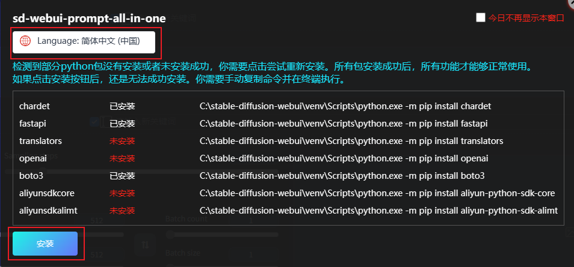

# 安裝套件

> 在某些情況下，安裝完成並重啟 WebUI 後，本擴展所需的 Python 軟體包可能無法自動安裝。這時候本擴展會彈出安裝視窗，你需要手動安裝。

## 自動安裝

1. 點擊 `Language` 切換語言。

2. 點擊 `安裝` 開始安裝。

3. 等待安裝完成。安裝完後成本視窗會自動關閉。

4. 刷新 WebUI 網頁，即可正常使用本擴展。

## 手動安裝

> 如果自動安裝失敗，或者刷新網頁後仍然彈出安裝視窗，你可以嘗試手動安裝。

1. 手動複製未安裝的軟體包後面的命令。

   

2. 打開系統終端，粘貼命令並執行。

   

3. 所有命令執行完畢後，刷新 WebUI 網頁，即可正常使用本擴展。