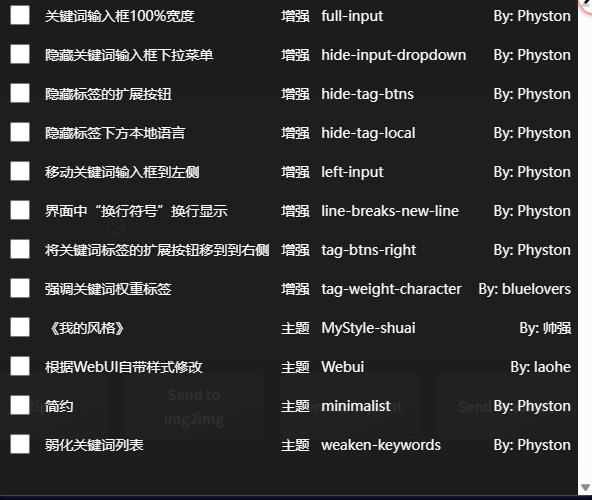

# 主題風格

1. 把滑鼠移動到 `擴展主題樣式圖示` 上。

   

2. 點擊 `擴展主題樣式圖示`。

   

3. 其中有【主題】、【增強】兩種分類。

   - 【主題】：主要是修改擴展的整體主題風格。
   - 【增強】：主要是增強擴展的風格。

4. 【主題】分類，建議只開啟一個主題，否則可能會出現樣式衝突。

5. 根據個人需求，啟用不同的主題風格。

   

6. 如果你需要開發此擴展的樣式主題，請參考：[https://github.com/Physton/sd-webui-prompt-all-in-one/tree/main/styles/extensions#简体中文](https://github.com/Physton/sd-webui-prompt-all-in-one/tree/main/styles/extensions#简体中文)